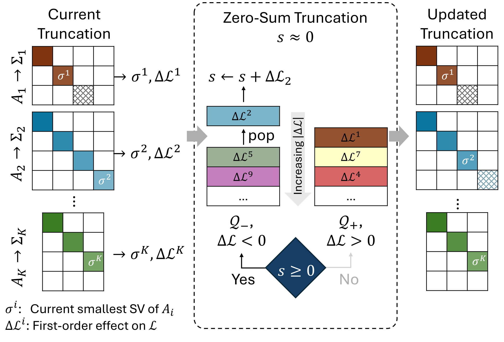

<p align="center">
  
</p>

<p align="center">
  
</p>

<h1 align="center"><big><big>Zero Sum SVD: Balancing Loss Sensitivity for Low Rank LLM Compression</big></big></h1>


<p align="center">
  <a href="https://arxiv.org/abs/2602.02848"></a>
  <a href="https://mint-vu.github.io/ZS-SVD/"></a>
  <a href="https://www.python.org/downloads/release/python-390/"></a>
  <a href="https://pytorch.org/"></a>
  <a href="#"></a>
</p>

> **[Zero Sum SVD: Balancing Loss Sensitivity for Low Rank LLM Compression](https://arxiv.org/abs/2602.02848)**
>
> *Ali Abbasi, Chayne Thrash<sup>\*</sup>, Haoran Qin<sup>\*</sup>, Shansita Sharma, Sepehr Seifi, Soheil Kolouri*
>
> *MINT Lab, Vanderbilt University*
>
> International Conference on Machine Learning (ICML) 2026 &nbsp;·&nbsp; <sup>\*</sup>Equal contribution
>
> Project page: [mint-vu.github.io/ZS-SVD](https://mint-vu.github.io/ZS-SVD/)

## Overview

**Zero Sum SVD (ZS-SVD)** is a post-training, SVD-based compression method for large language models. It scores each singular value of every weight matrix with a first-order calibration-loss estimate in whitened coordinates, then prunes singular values under a **zero-sum rule** that keeps the cumulative predicted loss change near zero. The result is **heterogeneous per-matrix ranks** under a single global compression ratio — without solving an expensive rank-allocation optimization. An optional lightweight correction (one projected gradient step after truncation, then re-truncate) recovers further accuracy at high compression ratios.

<p align="center">
  
</p>

*Zero-sum selection rule across different weight matrices.*

## What's in this repo

```
main_zero_sum.py            # main compression entry point
evaluate_from_ckpt.py       # standalone evaluator (PPL + commonsense)
convert_to_hf_style.py      # convert a saved .pt checkpoint to a HuggingFace folder

compression/                # modular compression pipeline
  args.py                       CLI definition + validation
  profiling.py                  whitening / activation Gram accumulators
  importance.py                 gradient-sigma importance per module
  gradient.py                   gradient accumulation orchestrator
  planning.py                   per-stage module-state planning
  truncation.py                 SVD truncation application
  corrections.py                between-stage correction methods
  losses.py                     CE loss helpers
  evaluation.py                 commonsense / JSON utilities
  batch_utils.py                tensor / batch plumbing

utils/
  model_utils.py              model loading + LowRankLinear primitive
  data_utils.py               calibration + test data loaders
  eval_utils.py               ppl_eval primitive shared across entries
  correction_utils.py         shared correction / densification helpers
  quant_utils.py              bitsandbytes 8-bit quant/dequant
  LoRA.py                     LoRA fine-tuning script
  peft/                       vendored PEFT package
```

## Installation

This codebase pins `transformers==4.35.2`; use **Python 3.9** for the dependency set to install cleanly.

```bash
conda create -n compress python=3.9 -y
conda activate compress
pip install -r requirements.txt
```

For **C4 perplexity evaluation**, place `c4-validation.json` under `utils/` — the original Hugging Face download link is no longer maintained. You can grab it from this [Google Drive mirror](https://drive.google.com/drive/folders/123Id1MkZVsKySGy_sMO4RgiJKrtPcvUp).

## Supported models

Architecture is auto-detected from the `--model` ID string. The table below lists model IDs that have been exercised by the pipeline:

| Family | Model ID |
|--------|----------|
| LLaMA-1 | `jeffwan/llama-7b-hf` (default) |
| LLaMA-1 | `jeffwan/llama-13b-hf` |
| LLaMA-1 | `huggyllama/llama-30b` |
| LLaMA-2 | `meta-llama/Llama-2-7b-hf` |
| Mistral | `mistralai/Mistral-7B-v0.1` |
| Vicuna  | `lmsys/vicuna-7b-v1.5` |
| OPT     | `facebook/opt-6.7b` |

Any other LLaMA-1/2 / Mistral / Vicuna / OPT / DeepSeek checkpoint should also work — the layer dispatcher in `utils/model_utils.py:get_layers` keys on substrings of the model name.

## Key concepts

- **`global_prune_ratio`**: fraction of target weights to remove globally.
  Example: `--global_prune_ratio 0.2` removes 20% of parameters (keeps 80%).
- **`num_stages`**: number of outer truncation stages.
  Each outer stage applies one truncation step followed by a between-stage correction. `num_stages=N` yields `N-1` correction steps after the initial cut.
- **`keep_rank_ratio`**: minimum rank floor per module, expressed as a fraction of the break-even rank `r*`. `0` means no floor; `0.3` keeps at least 30% of `r*` for every module.

## Compression (`main_zero_sum.py`)

### Critical notes

1. For models **other than** `jeffwan/llama-7b-hf`, use `--num_stages 6` (5 correction steps).
2. For `--global_prune_ratio 0.2` and `0.4`, pass `--remap` (bnb int8 row-remap quantization of the low-rank factors).
3. For `--global_prune_ratio 0.6`, pass `--quantize_8_bit` instead of `--remap`.
4. `--global_prune_ratio 0.2` is memory-heavy; do not run two `0.2` jobs on the same machine. `0.4` and `0.6` can share a machine.
5. On memory-constrained machines, the main flag to add is `--efficient_importance` (compute importance one module at a time and accumulate only `grad_σ` on CPU). For more aggressive cuts, also pass any of `--profile_independently`, `--efficient_accumulate` (with `--efficient_accumulate_chunk_tokens` and `--efficient_accumulate_dtype`) — see the [Efficiency flags](#efficiency-flags) section below for details.

### Running the compression

Three runnable wrappers live under [`scripts/`](scripts/). Each takes the prune ratio as its first positional argument and auto-selects the right `--keep_rank_ratio` (0 at 0.2 / 0.4, 0.3 at 0.6) and quantization flag.

| Script | What it runs |
|---|---|
| [`scripts/run_one_shot.sh`](scripts/run_one_shot.sh) | One-shot baseline: a single truncation stage with no quantization and no between-stage correction. The minimal pipeline configuration. |
| [`scripts/run_remap_quant.sh`](scripts/run_remap_quant.sh) | One-shot + post-truncation quantization: adds `--remap` at prune ratio 0.2 / 0.4, or `--quantize_8_bit` at 0.6. |
| [`scripts/run_multistage.sh`](scripts/run_multistage.sh) | Multi-stage compression: `--num_stages 6` plus the pull-subspace correction. Required for any model other than `jeffwan/llama-7b-hf`; generally better PPL. |

```bash
bash scripts/run_one_shot.sh 0.2          # one-shot, 20% prune
bash scripts/run_remap_quant.sh 0.4       # one-shot + --remap, 40% prune
bash scripts/run_multistage.sh 0.6        # multi-stage, 60% prune

# Compress a different model
MODEL=meta-llama/Llama-2-7b-hf bash scripts/run_multistage.sh 0.2
```

Default model is `jeffwan/llama-7b-hf`; set the `MODEL` environment variable to override. The scripts themselves are short — open them to see the exact flags each one passes to `main_zero_sum.py`. For canonical paper-table recipes that combine multi-stage with `--remap` / `--quantize_8_bit`, see `scripts/reproduce/` (TODO).

## Evaluation (`evaluate_from_ckpt.py`)

### Example command

```bash
CUDA_VISIBLE_DEVICES=0 python evaluate_from_ckpt.py \
  --ckpt_path ./<exp_tag>/stage02_after_truncation_fp16.pt \
  --eval_ppl --ppl_datasets wikitext2,ptb,c4 \
  --evaluate_commonsense \
  --commonsense_tasks arc_easy,arc_challenge,openbookqa,winogrande,hellaswag,piqa,mathqa \
  --eval_dtype fp32 --DEV cuda
```

### Key arguments

| Argument | Purpose |
|----------|---------|
| `--ckpt_path` | Path to a checkpoint saved by `main_zero_sum.py` |
| `--eval_ppl` | Run perplexity evaluation |
| `--ppl_datasets` | Datasets for PPL (`wikitext2`, `ptb`, `c4`) |
| `--evaluate_commonsense` | Run lm_eval commonsense benchmarks |
| `--commonsense_tasks` | Comma-separated lm_eval task names |
| `--eval_dtype` | Evaluation precision (`fp32`, `bf16`, `fp16`) |
| `--DEV` | Device (`cuda` or `cpu`) |

## Compression flag reference

### Key options

| Flag | Meaning |
|---|---|
| `--global_prune_ratio` | Fraction of target weights to remove globally |
| `--num_stages` | Number of outer truncation stages (1 = one shot, ≥2 = staged with between-stage corrections) |
| `--selection_mode` | `zero_sum` (default), `vanilla_svd`, `smallest_mag`, `only_delta_ce`, `sval_mag_het`, `svdllm`, `delta_in_subspace`, `negative_sum`, etc. |
| `--keep_rank_ratio` / `--use_absolute_min_rank` | Floor rank per module |
| `--remap` | Apply bnb int8 row-remap quantization to the saved low-rank factors (DobiSVD-style quantization). |
| `--quantize_8_bit` | Store weights in uint8 and halve the prune ratio target — the "half-prune-then-quantize" (HQ) variant from the paper. |
| `--initial_eval_ppl`, `--initial_evaluate_commonsense` | Evaluate the uncompressed teacher before compression |
| `--evaluate_commonsense` | Run lm_eval commonsense tasks after compression |

Run `python main_zero_sum.py --help` for the full list.

### Efficiency flags

These flags reduce GPU / CPU memory pressure at the cost of throughput. Useful when running large models (13B+) on limited hardware.

| Flag | Meaning |
|---|---|
| `--efficient_importance` | Compute importance gradients one module at a time and accumulate only `grad_σ` (length `r`) on CPU, instead of storing full weight-size average gradients. Significant CPU-RAM win on large models. |
| `--profile_independently` | Compute a separate whitening matrix for each target module (rather than sharing one whitening matrix across modules that read the same input activation). Increases memory but can improve numerical stability for very heterogeneous activations. |
| `--efficient_accumulate` | Chunk the activation-gram accumulation during profiling and offload the covariance to CPU. Lowers GPU peak memory at the cost of additional CPU↔GPU transfers. |
| `--efficient_accumulate_chunk_tokens T` | Token-chunk size used by `--efficient_accumulate` (default `256`). Smaller = lower GPU peak, slower. |
| `--efficient_accumulate_dtype` | Dtype used on GPU for the chunked gram matmul under `--efficient_accumulate`. Choices: `bf16` (default), `fp16`, `fp32`. Lower precision = less memory but more numerical error. |

### Ablation flags

The following flags expose alternative between-stage correction methods. None are enabled by the published scripts; pass them on top of any one-shot or multi-stage command to ablate the corresponding variant.

| Flag | Meaning |
|---|---|
| `--alpha_blend_correction` | Between stages, blend current truncated weights toward the cached teacher weights using `W ← W + α · (W_T − W)`. Acts as a soft pull toward the uncompressed teacher. |
| `--blend_factor α` | Alpha used by `--alpha_blend_correction`. Default `0.0`; typical range 0–1. |
| `--project_to_delta` | Between stages, compute an average gradient direction and project it onto the delta-to-teacher direction, then snap weights by adding that projected component (no fixed step size). |
| `--n_samples_proj_to_delta N` | Number of calibration batches used to average gradients for `--project_to_delta`. Defaults to the full base calibration set. |
| `--gd_correction_mode` | After each truncation step, compute an average gradient over a calibration subset and take one manual gradient-descent step along it. |
| `--gd_correction_lr η` | Learning rate for the one-step `--gd_correction_mode` (default `1e-4`). |
| `--nsamples_gd_correction N` | Number of calibration samples used to average the gradient for `--gd_correction_mode`. Defaults to the full base calibration set. |

## Converting checkpoints to HuggingFace format (`convert_to_hf_style.py`)

By default `main_zero_sum.py` saves a compressed model as a single `.pt`
blob with the format `{"model": ..., "tokenizer": ...}`. Use
`convert_to_hf_style.py` to turn that blob into a standard HuggingFace
`save_pretrained`-style directory (sharded `safetensors` + `config.json`
+ tokenizer files), so you can load it via the usual
`AutoModelForCausalLM.from_pretrained(...)` flow.

### Example

```bash
python convert_to_hf_style.py \
  --ckpt_path ./<exp_tag>/final_<...>.pt \
  --output_dir ./<exp_tag>/final_hf
```

The output directory follows HF conventions and can be loaded by any
standard HuggingFace pipeline:

```python
from transformers import AutoModelForCausalLM, AutoTokenizer

model = AutoModelForCausalLM.from_pretrained("./<exp_tag>/final_hf")
tokenizer = AutoTokenizer.from_pretrained("./<exp_tag>/final_hf")
```
